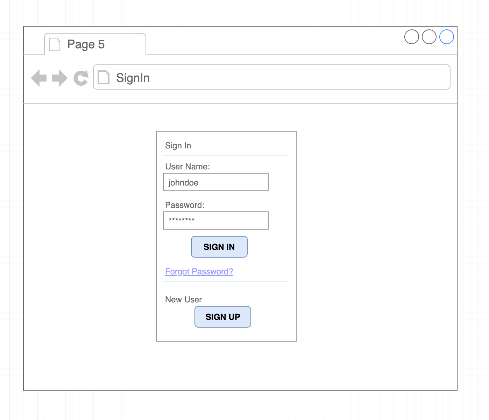

#  
#  Project #4: Shopping Website
 
## Table of Contents
- [User Story](#user-story)
- [Entity Relationship Diagram](#entity-relationship-diagram)
- [Wireframe](#wireframe)
- [Technologies used](#Technologies)
- [Further Study](#further-study)

## User Story 
1. Can Sign up and Sign in.
2. The Admin have the ability to add Product.
3. The Admin have the ability to edit Product.
4. The Admin have the ability to delete Product.
5. The Customer have the ability to display the Products.

## Entity Relationship Diagram

## Wireframe

## Technologies
* [npm](https://www.npmjs.com/package/download).
* [Postman](https://www.getpostman.com/downloads/).
* [React.js](https://react-cn.github.io/react/downloads.html).
* [Node.js](https://nodejs.org/en/download/).
* [Express.js ](https://expressjs.com/en/starter/installing.html).
* [ExpressTemplate](https://github.com/sei-relativity/express-api-template)
* [ReactTemplate](https://github.com/sei-relativity/react-template)

## Future Development
* Let the Customer has the ability to add Orders

